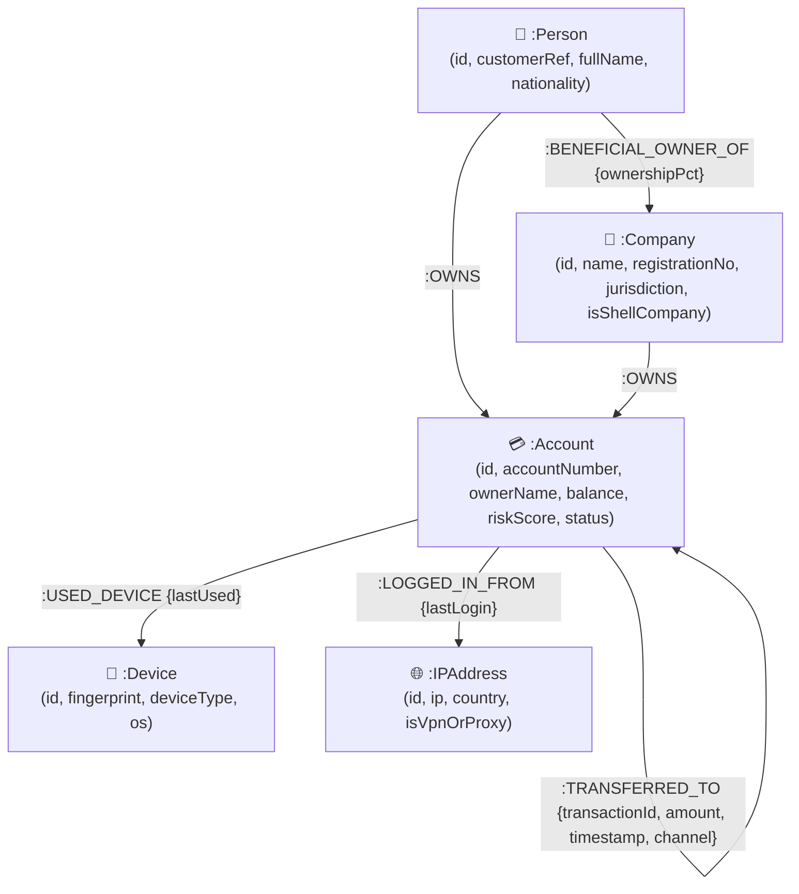

# FinGraph AI — Financial Crime & Fraud Ring Intelligence Platform

A complete, production-style web application backed by **CognoDB Cloud** (using the official Neo4j driver over Bolt 5.x) and **openCypher**, engineered with **TypeScript** for the backend API & database seeding engine and browser-native JavaScript for the frontend canvas visualization.

---

## 🎯 Use Case Overview & "Why a Graph Database?"

### Use Case
Financial crime investigations require discovering complex transaction networks—such as layered shell companies, multi-tiered circular money loops designed to evade AML thresholds, and coordinated Sybil rings operating through shared TOR IP addresses and device emulators.

### Why a Graph Database Over a Relational Schema?

Relational databases (RDBMS) model data in tabular rows and foreign keys (`JOIN`). However, in financial crime investigation, key patterns are defined by **variable-length paths and indirect connections**:

1. **Circular Money Laundering Detection**:
   - *Relational Challenge*: Detecting money moving through an arbitrary number of intermediate accounts back to the origin ($A \to B \to C \to D \to A$) in SQL requires complex recursive CTEs or rigid fixed $N$-way `JOIN` statements scaling exponentially with depth $O(V^N)$.
   - *Graph Solution*: Cypher pattern matching evaluates variable-length cycles natively with efficient multi-hop graph traversals:
     ```cypher
     MATCH path = (a:Account)-[r:TRANSFERRED_TO*3..6]->(a)
     WHERE ALL(x IN relationships(path) WHERE x.amount >= $minAmount)
     RETURN path
     ```
2. **Shared Infrastructure Sybil Rings**:
   - *Relational Challenge*: Uncovering distinct accounts connected indirectly through shared device emulators (`Device`) or TOR VPN exit nodes (`IPAddress`) across 2 to 4 indirect hops requires multiple $M:N$ bridge tables and expensive table scans.
   - *Graph Solution*: Graph index-free adjacency traverses index pointers directly from `(Account)` nodes to `(Device)` and `(IPAddress)` nodes in $O(1)$ per hop:
     ```cypher
     MATCH (a1:Account)-[:USED_DEVICE|LOGGED_IN_FROM]->(infra)<-[:USED_DEVICE|LOGGED_IN_FROM]-(a2:Account)
     WHERE a1.id < a2.id AND (a1.status IN ['FLAGGED', 'SUSPICIOUS'] OR a2.status IN ['FLAGGED', 'SUSPICIOUS'])
     RETURN a1, infra, a2
     ```
3. **Multi-Hop Money Trails & Blast Radius**:
   - *Relational Challenge*: Calculating shortest paths between a target account and an OFAC-sanctioned crypto vault across mixed entity types (Accounts, Shell Companies, Beneficial Owners) requires custom graph algorithms outside SQL.
   - *Graph Solution*: Native Cypher algorithms (`shortestPath`) evaluate graph reachability seamlessly.

---

## 📊 Graph Data Model & Schema Diagram



### Node Labels & Properties (No PII)
- **`:Account`**: `id`, `accountNumber`, `ownerName`, `bankName`, `balance`, `riskScore`, `status` (`NORMAL`, `SUSPICIOUS`, `FLAGGED`, `SANCTIONED`), `type`.
- **`:Person`**: `id`, `customerRef` (e.g. `CUST-10042`), `fullName`, `nationality`, `riskCategory`.
- **`:Company`**: `id`, `name`, `registrationNo`, `jurisdiction`, `isShellCompany` (Boolean).
- **`:Device`**: `id`, `fingerprint`, `deviceType`, `os`.
- **`:IPAddress`**: `id`, `ip`, `country`, `isVpnOrProxy` (Boolean).

---

## ⚙️ Setup & Run Instructions

### 1. Provision CognoDB Cloud Instance
1. Sign up at [https://console.cognodb.com/signup](https://console.cognodb.com/signup) (Free c0 instance, no credit card).
2. Note down your Bolt URI (`bolt+s://<instance-id>.databases.cognodb.cloud`), username `cognodb`, and generated password.

### 2. Environment Configuration
Copy `.env.example` to `.env`:
```bash
cp .env.example .env
```
Set your environment variables in `.env`:
```env
COGNODB_URI=bolt+s://<your-instance-id>.databases.cognodb.cloud:7687
COGNODB_USER=cognodb
COGNODB_PASSWORD=your_actual_password_here
PORT=3000
```

> ⚠️ **Database Error Handling**: If CognoDB is unconfigured or unreachable, FinGraph AI displays an explicit **Database Disconnected Alert Banner** with a `[ Retry Connection ]` button as required by Wexa's error handling guidelines.

### 3. Install Dependencies & Seed CognoDB
```bash
# Install packages
npm install

# Build TypeScript codebase
npm run build

# Seed live CognoDB Cloud graph topology
npm run seed
```

### 4. Start Server
```bash
npm start
```
Open **`http://localhost:3000`** in your browser.

---

## 🔍 Verified openCypher Queries

### 1. Circular Money Laundering Detection (3+ Hops)
```cypher
MATCH path = (a1:Account)-[:TRANSFERRED_TO]->(a2:Account)-[:TRANSFERRED_TO]->(a3:Account)-[:TRANSFERRED_TO*1..3]->(a1)
RETURN path, length(path) AS cycleLength
LIMIT $limit
```
> **Why this pattern?** CognoDB's openCypher implementation requires explicit hop expansion rather than `(a)-[*3..6]->(a)` self-referencing syntax. This query finds all cycles of 3+ hops where money returns to the originating account.

### 2. Shared Infrastructure Sybil Fraud Ring
```cypher
MATCH (a1:Account)-[r1:USED_DEVICE|LOGGED_IN_FROM]->(infra)<-[r2:USED_DEVICE|LOGGED_IN_FROM]-(a2:Account)
WHERE a1.id < a2.id AND (a1.status IN ['FLAGGED', 'SUSPICIOUS'] OR a2.status IN ['FLAGGED', 'SUSPICIOUS'])
OPTIONAL MATCH (a1)-[t:TRANSFERRED_TO]-(a2)
RETURN a1, infra, a2, r1, r2, t
LIMIT $limit
```

### 3. Multi-Hop Money Trail (Shortest Path)
```cypher
MATCH (source:Account {id: $sourceId}), (target:Account {id: $targetId})
MATCH p = shortestPath((source)-[:TRANSFERRED_TO|OWNS|LOGGED_IN_FROM|USED_DEVICE*..8]-(target))
RETURN p, length(p) AS hopCount
```

### 4. Corrected Fraud Blast Radius Exposure
```cypher
MATCH (flagged:Account {id: $flaggedId})
MATCH path = (flagged)-[:TRANSFERRED_TO*1..3]-(target:Account)
WHERE target.id <> $flaggedId
RETURN target.id AS accountId,
       target.ownerName AS ownerName,
       min(length(path)) AS distanceHops,
       count(DISTINCT path) AS totalPaths
ORDER BY distanceHops ASC, totalPaths DESC
LIMIT $limit
```

---

## 🏗️ Architecture & Project Structure

```
FinGraph AI Architecture (TypeScript + Browser JS)
├── tsconfig.json               # TypeScript compiler options
├── package.json                # Project scripts & dependencies
├── README.md                   # Complete assignment documentation
├── scripts/
│   └── seed.ts                 # Graph database seeding CLI script (TypeScript + neo4j-driver)
├── src/
│   ├── server/                 # TypeScript Backend Services & REST APIs
│   │   ├── index.ts            # Express server entry point
│   │   ├── config/
│   │   │   └── database.ts     # Neo4j driver connection verifier & error handling
│   │   ├── services/
│   │   │   └── graphService.ts # Parameterised Cypher query & Explainability engine
│   │   └── routes/
│   │       └── api.ts          # REST endpoints
│   └── client/                 # Browser-native Frontend Interface
│       ├── index.html          # AML Investigation Workbench layout
│       ├── css/styles.css      # Dark glassmorphic theme & alert styling
│       └── js/
│         ├── app.js            # Client controller & explainability integration
│         ├── graphRenderer.js  # HTML5 2D Canvas force graph renderer
│         └── cypherConsole.js  # Cypher modal formatter
```

---

## 🕵️ AML Explainability Engine

When inspecting any suspicious entity, FinGraph AI dynamically computes graph evidence breakdown:
- `✓ Participates in a 4-hop circular money laundering loop ($250,000)`
- `✓ Shares Rooted Android Emulator DEV-909 with 3 flagged accounts`
- `✓ Transferred $180,000 to multi-hop bridge account`
- `✓ Owned by Offshore Shell Company Apex Zenith Capital (BVI)`

---

## 🖥️ UI Screenshots

### Graph Topology Overview (Desktop)
The main workbench renders all 28 graph entities and 35+ relationships as an interactive force-directed canvas with zoom, pan, and node drag.

### Circular Money Laundering Detection
Clicking "Circular Money Laundering" highlights the 4-hop cycle (ACC-101 → ACC-102 → ACC-103 → ACC-104 → ACC-101) while dimming unrelated entities.

### Shared Infrastructure Sybil Ring
Clicking "Shared Infrastructure Ring" highlights accounts ACC-301–ACC-304 connected through shared Rooted Android Emulator DEV-909 and TOR Exit Node IP-002.

### Multi-Hop Money Trail
Traces the shortest path from ACC-104 through ACC-501 to OFAC-Sanctioned Vault ACC-999.

### Entity Inspector & Graph Risk Explainability
Right panel shows per-entity risk score, property details, connected relationships, and AI-generated graph evidence breakdown.

### Database Disconnected Error State
When CognoDB Cloud is unreachable, a prominent red alert banner with `[ Retry Connection ]` button appears.

> **Note**: Replace the descriptions above with actual screenshots before submission. Use browser DevTools to capture at each investigation state.

---

## 🌐 Hosted Demo & Screen Recording

- **Live Hosted Application**: **[https://fingraph-ai-six.vercel.app](https://fingraph-ai-six.vercel.app)** (Deployed on Vercel with live CognoDB Cloud connection)
- **Screen Recording**: *(Add your 1–2 min video walkthrough link here)*

---

## 📄 License

This project was built as a take-home assignment for Wexa AI. All code is original.

